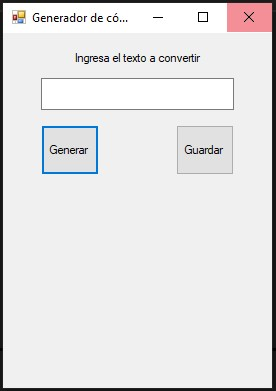
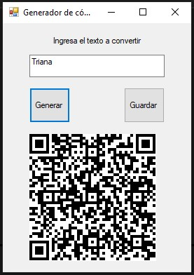

# Generador de Códigos QR

Aplicación de escritorio desarrollada en C# con Windows Forms que permite generar y guardar códigos QR a partir de texto ingresado por el usuario.

## 🖥️ Características

- Generación de código QR con texto personalizado
- Visualización previa del código QR generado
- Guardado del QR en formato JPEG
- Interfaz sencilla e intuitiva

## 🛠️ Tecnologías utilizadas

- C#
- Windows Forms (.NET Framework)
- [Zen.Barcode](https://www.nuget.org/packages/Zen.Barcode.Rendering.Framework/) (para la generación de códigos QR)

## 📸 Capturas de pantalla





## 🚀 Cómo usarlo

1. Clona este repositorio:
   ```bash
   git clone https://github.com/IngTriana/Generador-QR
